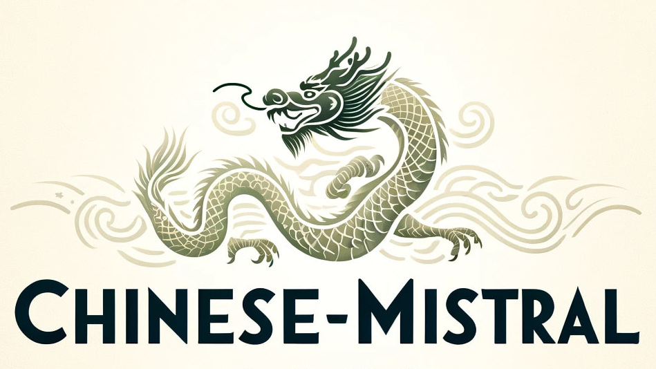

<div align="center">
    <h1>
        Chinese-Mistral
    </h1>
</div>

<p align="center">
    <br>
    
    <br>
</p>

<div align="center">
    <a href="https://github.com/THU-ESIS/Chinese-Mistral/pulls">
        <image src="https://img.shields.io/badge/PRs-welcome-brightgreen"></image>
        <image src="https://img.shields.io/badge/License-Apache_2.0-green.svg"></image>
    </a>
</div>

## 🎉 新闻
- [2024-10-11] [新文速递|PreparedLLM：高效训练领域大语言模型的“前预训练”框架](https://mp.weixin.qq.com/s/ugJQ9tbp6Y87xA3TOWteqw)。
- [2024-08-31] 文章[PreparedLLM: Effective Pre-pretraining Framework for Domain-specific Large Language Models](https://www.tandfonline.com/doi/full/10.1080/20964471.2024.2396159)已被*Big Earth Data*期刊接收。
- [2024-08-31] 发布[Chinese-Mistral-7B-Instruct-v0.2](https://huggingface.co/itpossible/Chinese-Mistral-7B-Instruct-v0.2)对话模型。语言理解能力大幅提高，并且具备多轮对话能力。
- [2024-06-30] 发布[JiuZhou-Instruct-v0.2](https://huggingface.co/itpossible/JiuZhou-Instruct-v0.2)对话模型。语言理解能力大幅提高，并且具备多轮对话能力。
- [2024-04-04] 发布[Chinese-Mistral-7B-Instruct-v0.1](https://huggingface.co/itpossible/Chinese-Mistral-7B-Instruct-v0.1)。
- [2024-03-31] 发布[Chinese-Mistral-7B-v0.1](https://huggingface.co/itpossible/Chinese-Mistral-7B)基座模型。

## 🚀 介绍

随着Mistral AI公司开源其七十亿参数模型[Mistral-7B](https://huggingface.co/meta-llama/Llama-2-7b-hf)，该模型超越[Llama](https://huggingface.co/meta-llama)，成为当前最强大的开源模型之一。Mistral-7B在各类基准测试中，不仅超过了Llama2-13B，而且在推理、数学、代码生成任务中超过Llama2-34B。
然而，Mistral-7B的训练语料主要为英文文本，其中文能力较为欠缺。其次，Mistral-7B的词表不支持中文，导致其对中文的编码和解码效率较低，限制了在中文场景的应用。<br>
为了克服这一局限，清华大学地球系统科学系地球和空间信息科学实验室基于Mistral-7B进行了中文词表扩充和增量预训练，增强了Mistral-7B在中文任务上的表现，并提高了其对中文文本的编解码效率。

## 📥 模型下载

本项目开源了Chinese-Mistral-7B与Chinese-Mistral-7B-Instruct：

|             模型             |                                     下载地址                                      |                                                         说明                                                          |
|:-----------------------------:|:------------------------------------------------------------------------------:|:-------------------------------------------------------------------------------------------------------------------:|
|     Chinese-Mistral-7B     |     [HuggingFace](https://huggingface.co/itpossible/Chinese-Mistral-7B-v0.1)<br>[wisemodel](https://wisemodel.cn/models/itpossible/Chinese-Mistral-7B-v0.1)<br>[ModelScope](https://www.modelscope.cn/models/itpossible/Chinese-Mistral-7B-v0.1)     |                                                  完整基座模型                                                  |
| Chinese-Mistral-7B-Instruct-v0.1 | [HuggingFace](https://huggingface.co/itpossible/Chinese-Mistral-7B-Instruct-v0.1)<br>[wisemodel](https://wisemodel.cn/models/itpossible/Chinese-Mistral-7B-Instruct-v0.1)<br>[ModelScope](https://www.modelscope.cn/models/itpossible/Chinese-Mistral-7B-Instruct-v0.1) | 完整指令精调模型<br>中英文alpaca_gpt4进行lora微调|
| Chinese-Mistral-7B-Instruct-v0.2 | [HuggingFace](https://huggingface.co/itpossible/Chinese-Mistral-7B-Instruct-v0.2)<br>[wisemodel](https://wisemodel.cn/models/itpossible/Chinese-Mistral-7B-Instruct-v0.2)<br> | 完整指令精调模型<br>百万条高质量数据进行lora微调|


## 💻 模型推理

如下是使用Chinese-Mistral-7B进行推理的代码示例。

```python
import torch
from transformers import AutoTokenizer, AutoModelForCausalLM

device = torch.device("cuda:0") if torch.cuda.is_available() else torch.device("cpu")

model_path = "itpossible/Chinese-Mistral-7B-v0.1"
tokenizer = AutoTokenizer.from_pretrained(model_path)
model = AutoModelForCausalLM.from_pretrained(model_path, torch_dtype=torch.bfloat16, device_map=device)

text = "我是一个人工智能助手，我能够帮助你做如下这些事情："
inputs = tokenizer(text, return_tensors="pt").to(device)

outputs = model.generate(**inputs, max_new_tokens=300)
print(tokenizer.decode(outputs[0], skip_special_tokens=True))
```

如下是使用Chinese-Mistral-7B-Instruct进行推理的代码示例。
```python
import torch
from transformers import AutoTokenizer, AutoModelForCausalLM

device = torch.device("cuda:0") if torch.cuda.is_available() else torch.device("cpu")

model_path = "itpossible/Chinese-Mistral-7B-Instruct-v0.2"
tokenizer = AutoTokenizer.from_pretrained(model_path)
model = AutoModelForCausalLM.from_pretrained(model_path, torch_dtype=torch.bfloat16, device_map=device)

text = "请为我推荐中国三座比较著名的山"
messages = [{"role": "user", "content": text}]

inputs = tokenizer.apply_chat_template(messages, return_tensors="pt").to(device)
outputs_id = model.generate(inputs, max_new_tokens=300, do_sample=True)
outputs = tokenizer.batch_decode(outputs_id, skip_special_tokens=True)[0]
print(outputs)
```
Chinese-Mistral-7B 与Chinese-Mistral-7B-Instruct生成效果示例如下：

|     模型名称    	|      Chinese-Mistral-7B    	|     Chinese-Mistral-7B-Instruct    	|
|---	|---	|---	|
|     用户输入    	|     <div style="width: 270pt">我是一个人工智能助手，我能够帮助你做如下这些事情：    	|     <div style="width: 270pt">请为我推荐中国三座比较著名的山    	|
|     模型输出    	|     <div style="width: 270pt">1、搜索资料，我可以帮你搜索任何你需要的资料。比如搜索某本书的内容，搜索某某地的地图，搜索某部电影的播放地址等。<br>2、计算，我可以帮你计算各种数学题，比如加法，减法，乘积，除法等等。计算各种不同科目的公式，比如化学方程式的计算，物理公式的计算等。<br>3、做笔记，你可以把你的想法记录在我的字典里面，或者记录日程安排。<br>4、翻译，你可以把的设置为你的即时翻译器，将你要翻译的内容放到信息框里面，然后点击发送就可以。    	|     <div style="width: 270pt">中国的山川风景十分美丽，以下三座山是国内比较著名的景点：<br>1.泰山：泰山，位于山东省泰安市北部，历史悠久，是我国五大名山之一，海拔约1545米，其雄伟的地势和壮丽的风光吸引了不少游客前来游览。<br>2.黄山：黄山位于安徽省东南部，因独特的山水风光和丰富的文化和历史积淀而闻名于世，这里悬崖峭壁，奇峰怪石，云海雾海，景色奇特秀丽，被誉为“天下第一奇山”。<br>3.峨眉山：峨眉山位于四川省峨眉山市东北部，是中国四大佛教名山之一，因雄伟壮观的山峰和丰富多彩的森林资源而闻名于世。这里气候湿润，植被覆盖率极高，景色秀丽，被赞誉为“峨眉天下秀”。    	|

## 📈 模型性能

### 模型综合能力

我们采用C-Eval、CMMLU和MMLU三个评测数据集全面评估Chinese-Mistral-7B：

- C-Eval：它是一个全面的中文基础模型评估套件。包含13948个多项选择题，涵盖52个学科和四个难度级别。它旨在评估模型在人文、社科、理工等多个学科大类上的知识和推理能力。
- CMMLU：它是一个综合性的中文评估基准。涵盖了从基础学科到高级专业水平的67个主题。它专门用于评估语言模型在中文语境下的知识和推理能力。
- MMLU：它是一个包含了57个子任务的英文评测数据集。涵盖了从初等数学、美国历史、计算机科学到法律等多个领域，难度覆盖高中水平到专家水平，有效地衡量了模型在人文、社科和理工等多个学科大类中的综合知识能力。

下表展示了开源社区较流行的中文Llama2、中文Mistral与我们发布的Chinese-Mistral-7B的评测结果。评测方式采用5-shot，采用opencompass在相同的实验条件下进行评测。

|                                              模型名称                                              |    C-Eval     |      CMMLU    |    MMLU      |    平均得分        |
|:-----------------------------------------------------------------------------------------------:|:-------------:|:-------------:|:------------:|:-----------------:|
|    [Linly-Al/Chinese-LLaMA-2-7B-hf](https://huggingface.co/Linly-Al/Chinese-LLaMA-2-7B-hf)      |     31.2      |     30.14     |    35.09     |       32.14       |
|             [hfl/chinese-llama-2-7b](https://huggingface.co/hfl/chinese-llama-2-7b)             |     27.4      |     33.38     |    37.25     |       32.68       |
|    [Linly-Al/Chinese-LLaMA-2-13B-hf](https://huggingface.co/Linly-Al/Chinese-LLaMA-2-13B-hf)    |     39.9      |     42.48     |    52.54     |       44.97       |
|            [hfl/chinese-llama-2-13b](https://huggingface.co/hfl/chinese-llama-2-13b)            |     41.0      |     43.25     |    52.94     |       45.73       |
|      [gywy/Mistral-7B-v0.1-chinese](https://huggingface.co/gywy/Mistral-7B-v0.1-chinese)        |     37.4      |     36.45     |    37.38     |       37.08       |
|[OpenBuddy/openbuddy-mistral-7b-v13-base](https://huggingface.co/OpenBuddy/openbuddy-mistral-7b-v13-base)|     44.4      |     46.32     |    57.79     |       49.50       |
|                                  **[Chinese-Mistral-7B (本模型)](https://huggingface.co/itpossible/Chinese-Mistral-7B-v0.1)**                                  |     **47.5**      |     **47.52**     |    **58.29**     |       **51.10**       |

由上表可知，Chinese-Mistral-7B的中文和英文通识能力不仅超过同等参数量的中文Llama2模型，而且在多项评测中优于130亿参数量的中文Llama2。同时，Chinese-Mistral-7B的评测表现高于开源社区其他同等参数量的中文Mistral。

### 中文编解码效率

我们从WuDaoCorpus2中采样训练数据，使用sentencepiece训练中文BPE词表，并人工选取部分其他优秀中文词表进行词表融合。经过严格的人工审核，最终形成的词表大小为63776。为了提高模型计算效率，我们在词表末尾添加<|sym1|>、……、<|sym96|>，使得词表大小为128的倍数，最终得到的词表大小为63872。<br>
我们随机选取了WuDaoCorpus2_part-2021278643作为测试数据以评测分词效果。经统计，测试数据包括67013857个单词，我们用单词数量除以分词后的Token数量，计算压缩率。压缩率越大，表明分词效果越好，在中文场景的编解码效率越高。

|                                              模型名称                                              |    模型类型     |      词表大小    |    Token数量      |    压缩率        |
|:-----------------------------------------------------------------------------------------------:|:-------------:|:-------------:|:------------:|:-----------------:|
|    [meta-llama/Llama-2-7b-hf](https://huggingface.co/meta-llama/Llama-2-7b-hf)      |     Llama      |     32000     |    97406876     |       0.6880       |
|             [mistralai/Mistral-7B-v0.1](https://huggingface.co/mistralai/Mistral-7B-v0.1)             |     Mistral      |     32000     |    76269008     |       0.8787       |
|             [THUDM/chatglm2-6b](https://huggingface.co/THUDM/chatglm2-6b)             |     GLM      |     64789     |    43487673     |       1.5410       |
|    [Linly-Al/Chinese-LLaMA-2-13B-hf](https://huggingface.co/Linly-Al/Chinese-LLaMA-2-13B-hf)    |     Llama      |     40076     |    65402900     |       1.0246       |
|            [hfl/chinese-llama-2-13b](https://huggingface.co/hfl/chinese-llama-2-13b)            |     Llama      |     55296     |    45763513     |       1.4644       |
|      [OpenBuddy/openbuddy-mistral-7b-v13-base](https://huggingface.co/OpenBuddy/openbuddy-mistral-7b-v13-base)        |     Mistral      |     36608     |    65329642     |       1.0256       |
|[gywy/Mistral-7B-v0.1-chinese](https://huggingface.co/gywy/Mistral-7B-v0.1-chinese)|     Mistral      |     48593     |    46670146     |       1.4359       |
|                                  **[Chinese-Mistral-7B (本模型)](https://huggingface.co/itpossible/Chinese-Mistral-7B-v0.1)**                                   |     Mistral      |     63872     |    **43044156**     |       **1.5569**       |


由上表可知，Chinese-Mistral-7B在可观的词表大小情况下，取得了最高的压缩率，表明其能够高效处理中文文本。

## 📝 训练数据

训练数据采样于WanJuan、baike2018qa、Dolma、gutenberg-books等高质量开源数据集。我们对这些数据集进行细粒度清洗，并充分考虑训练数据集中不同类别数据的占比。

## ⚠️ 局限性

Chinese-Mistral-7B的开发旨在为开源社区提供一个性能优越的中文大语言模型。请注意，由于模型大小及训练数据规模限制，本模型仍可能生成误导性内容或者有害内容。因此，在部署任何由Chinese-Mistral系列模型驱动的应用程序之前，开发人员必须进行安全测试，对模型进行相应调整，以满足安全性需求。

## ✒️ 引用

如果您觉得本项目对您的研究有所帮助或使用了本项目的模型，请引用本项目：

```bibtex
@article{chen2024preparedllm,
  author = {Chen, Zhou and Lin, Ming and Wang, Zimeng and Zang, Mingrun and Bai, Yuqi},
  title = {PreparedLLM: Effective Pre-pretraining Framework for Domain-specific Large Language Models},
  year = {2024},
  journal = {Big Earth Data},
  pages = {1--24},
  doi = {10.1080/20964471.2024.2396159},
  url = {https://doi.org/10.1080/20964471.2024.2396159}
}

@misc{Chinese-Mistral,
    author = {Zhou, Chen and Yuqi, Bai},
    title = {Chinese-Mistral: An Efficient and Effective Chinese Large Language Model},
    year = {2024},
    publisher = {GitHub},
    journal = {GitHub repository},
    howpublished = {\url{https://github.com/THU-ESIS/Chinese-Mistral}}
}
```

## 结语
我们欢迎社区的支持和合作，共同推动通用大语言模型和领域大语言模型的发展。联系方式：<br>
白玉琪，清华大学地球系统科学系长聘教授，实验室负责人，yuqibai@tsinghua.edu.cn<br>
陈舟，清华大学地球系统科学系博士生，大语言模型组组长，chenz22@mails.tsinghua.edu.cn
